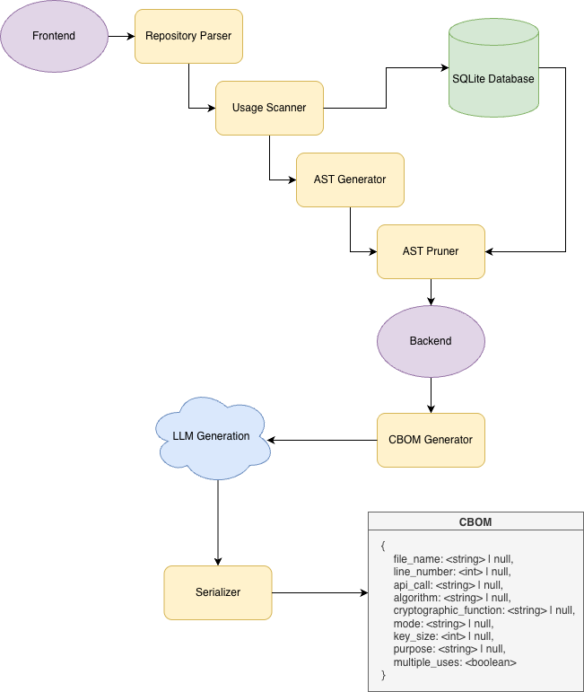

# open-pqc-inventory

Modeled After [Cryptoscope](https://research.ibm.com/publications/cryptoscope-analyzing-cryptographic-usages-in-modern-software)

## Diagram

## Future Improvements
- Extend langauge support (Python, C++, Java)
- Network Analyzer
- Filesystem Analyzer
- AST vs source file toggle
- Tests
- Error handling
- Expand regex's
- Start support for specific libraries